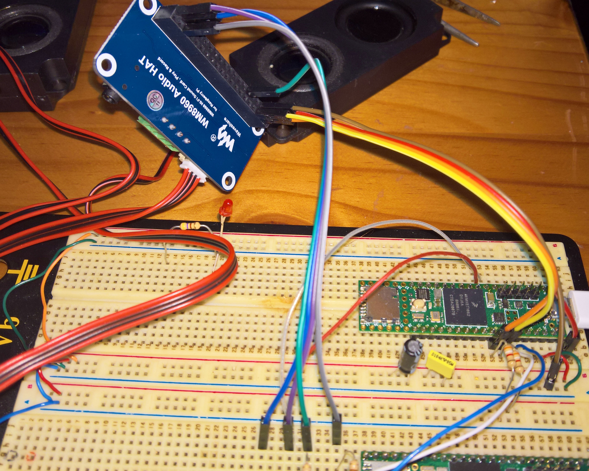

# Wolfson-WM8960-Arduino-Teensy-Driver
Driver and example applications for Arduino and Teensy MCUs for the Wolfson WM8960 Audio DAC. 

Note the difference in the headphone output circuit between the Waveshare Raspberry Pi Hat (which is also used in the Seeed Studio Re-Speaker Hat), and the Waveshare Audio CODEC module. That combination of the CODEC and Teensy sounds much better in the low range end due to the LC filter at the headphone plug. Both type of audio codec modules need an additional section of code in the main loop to enable manual switching between speaker and headphones (similar to the option in the Linuc alsamixer) - this will be added soon. 

In addition a section for the windows main volume control will be added (currently the application in windows control the DAC volume).

[**Cirrus Logic Product WM8960**](https://www.cirrus.com/products/wm8960/) 

[**Waveshare WM8960 Stereo CODEC General purpose module**](https://www.waveshare.com/wm8960-audio-board.htm)

  
 
 
 

[**Waveshare WM8960 Hi-Fi Sound Card HAT for Raspberry Pi**](https://www.waveshare.com/wm8960-audio-hat.htm)

  
 
   
 
  
**Teensy 4.0 and the Waveshare WM8960 Stereo CODEC as USB Audio DAC:**

  
 
  
**Teensy 4.1 and the Waveshare WM8960 Raspberry Pi Hat as USB Audio DAC:**

This combination of the CODEC and Teensy sounds much better in the low range end due to the LC filter at the headphone plugs. It needs a new section of code to enable manual switching between speaker and headphones (similar to the option in the Linuc alsamixer).

  
 

**Raspberry Pi and Waveshare WM8960 as Audio DAC:**

  
 
<br

The WM8960 CODEC is also used by the [**Seeed voicecard**](https://github.com/respeaker/seeed-voicecard) or [**ReSpeaker 2-Mics Pi HAT**](https://wiki.seeedstudio.com/ReSpeaker_2_Mics_Pi_HAT/).

  
 
   
<br
